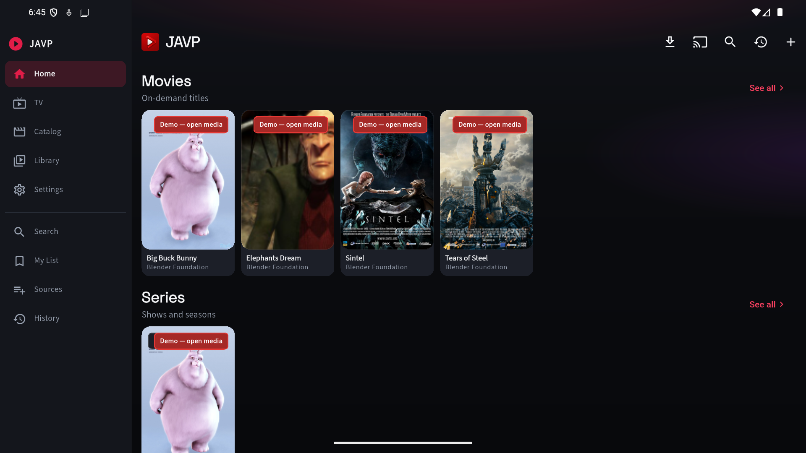
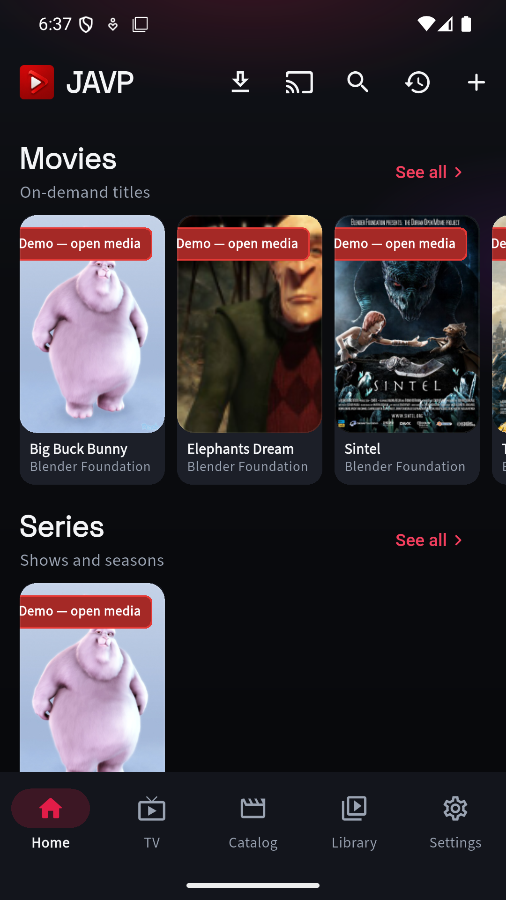
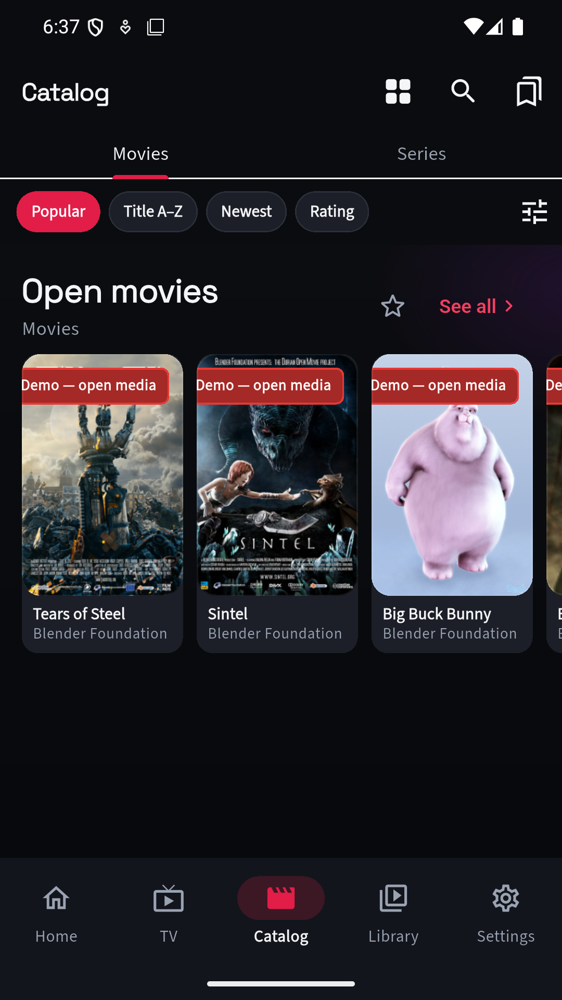

<p align="center">
  
</p>

# JAVP — Just Another Video Player

Bring-your-own media player for **Android**, **Windows**, **Linux**, and **macOS**. You connect **your** library — local files, Jellyfin / Emby / Plex, IPTV, JSON catalogs, magnets you supply. Nothing is bundled; credentials stay on the device.

> Sharp edges welcome. PRs too.

**[Download](https://updater.javp.app/)** · **[Releases](https://github.com/JAVPApp/JAVP/releases)** · **[Discord](https://discord.gg/deEVVzzaE4)**

<p align="center">
  
</p>
<p align="center">
  
  &nbsp;
  
</p>

<p align="center"><sub>Bundled <strong>Try demo</strong> catalog (Blender open movies + public HLS). No commercial titles.</sub></p>

## What you get

| Area | What it does |
| --- | --- |
| **Home** | Continue watching, For you, My List, favorites, discovery shelves |
| **TV** | Live channels, EPG, catchup / timeshift, quality picks, reminders |
| **Catalog** | Movies & series from media servers, Xtream, or a custom JSON catalog |
| **Library** | Local files, pasted URLs, magnets / torrents, offline downloads |
| **Music** | Optional tab (Appearance) for music-oriented browsing when your sources expose it |
| **Sports** | Follow leagues / teams; schedule-oriented browsing |
| **Player** | Hold-to-2×, double-tap skip, live DVR scrub, PiP, cast, captions, sleep timer |
| **Profiles** | Multi-profile, optional PIN, folder / WebDAV / Google Drive sync |

## Sources

Add from **Home → +**, **Sources**, or a deep link (`https://javp.app/add?…` / `javp://add?…`).

| Source | Live | VOD / series | Notes |
| --- | --- | --- | --- |
| **Local / URL** | — | Play | Library tab: pick files or paste HTTP(S) / HLS |
| **M3U / M3U8** | Yes | Playlist streams | Optional EPG URL |
| **Xtream Codes** | Yes | Optional VOD + series | Catchup / timeshift when the panel supports it |
| **Stalker / Ministra** | Yes | Portal lists | MAG-style portal |
| **Jellyfin / Emby / Plex** | Yes* | Yes | Plex: account sign-in or URL + token |
| **Custom JSON** | Optional | Optional | Your catalog URL — [API](docs/catalog-api.md) |
| **XMLTV** | — | — | EPG-only feed; attach to a live / media-server source |
| **Magnet / `.torrent`** | — | Stream | BYO only; content you have rights to |

\* When the server exposes live / DVR.

Optional: HTTP(S) / SOCKS5 proxy (per route), parental PIN, SIMKL / Trakt / Letterboxd / Serializd / BetaSeries, TMDB enrichment, Discord Rich Presence (desktop).

## Platforms

| | Sideload | Store |
| --- | --- | --- |
| **Android** | APK + in-app updater (`sideload` / `sideloadDev`) | Google Play AAB (`play`) |
| **Windows** | Zip + Inno + WinGet scaffolding | Microsoft Store MSIX (`msstore`) |
| **Linux / macOS** | Portable zip (macOS unsigned for now) | Mac App Store planned |

Experimental: [web](docs/web.md), [Smart TV](docs/smart-tv.md) (Tizen / webOS). Capabilities differ by port — see [features](docs/features.md).

## Docs

| Doc | For |
| --- | --- |
| **[Features](docs/features.md)** | Tabs, routes, what each surface does |
| **[Screenshots](docs/screenshots/)** | Demo-catalog phone + wide captures |
| **[Sources](docs/sources.md)** | Adding / syncing sources, deep links, EPG |
| **[Playback](docs/playback.md)** | Player, downloads, torrents, cast, proxy |
| **[Profiles & sync](docs/sync.md)** | Multi-profile, Drive / WebDAV / folder, pairing |
| **[Catalog API](docs/catalog-api.md)** | Custom JSON catalog contract |
| **[Develop](docs/develop.md)** | Build, flavors, desktop, l10n, TV |
| **[Architecture](docs/architecture.md)** | Where to edit code |
| **[Updates](docs/updates.md)** | Sideload updater & publish |
| **[Play Store](docs/play-store.md)** / **[Microsoft Store](docs/microsoft-store.md)** | Store packaging |
| **[Roadmap](docs/roadmap.md)** | Near / mid / later |
| **[Contributing](CONTRIBUTING.md)** | PRs, changelog, secrets |

## Quick start (dev)

```bash
flutter pub get
flutter test
flutter run --flavor sideload --dart-define=JAVP_DISTRIBUTION=sideload
flutter run -d windows   # no flavor
```

Details: **[docs/develop.md](docs/develop.md)**.

## License

**GNU GPL-3.0-or-later** — [`LICENSE`](LICENSE), [`NOTICE.md`](NOTICE.md).

Bundled third-party bits keep their own licenses (see `NOTICE.md`).

**Not legal advice.** Bring-your-own media only. Optional TMDB / SIMKL / Cast use is subject to those providers’ terms (TMDB attribution is in Settings).
